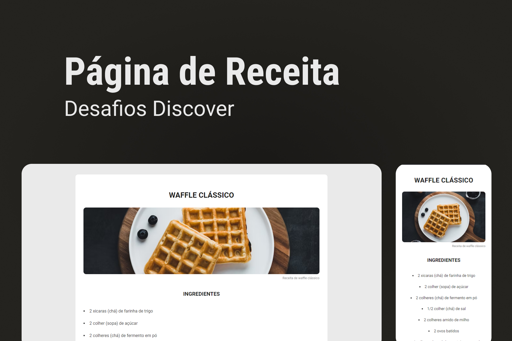

<h1 align="center"> Página de Receita </h1>

 

  

## 🚀 Tecnologias

Esse projeto foi desenvolvido com as seguintes tecnologias:

- HTML e CSS
- Git e Github
- Figma

## 💻 Projeto

O DevLinks é um agregador de links para usar como cartão de visitas online.

- [Acesse o projeto finalizado, online](https://LKaua22k.github.io/RecipePage)

## 📝 Licença

Esse projeto está sob a licença MIT.

---

Feito com ♥ by Kauã :wave: 